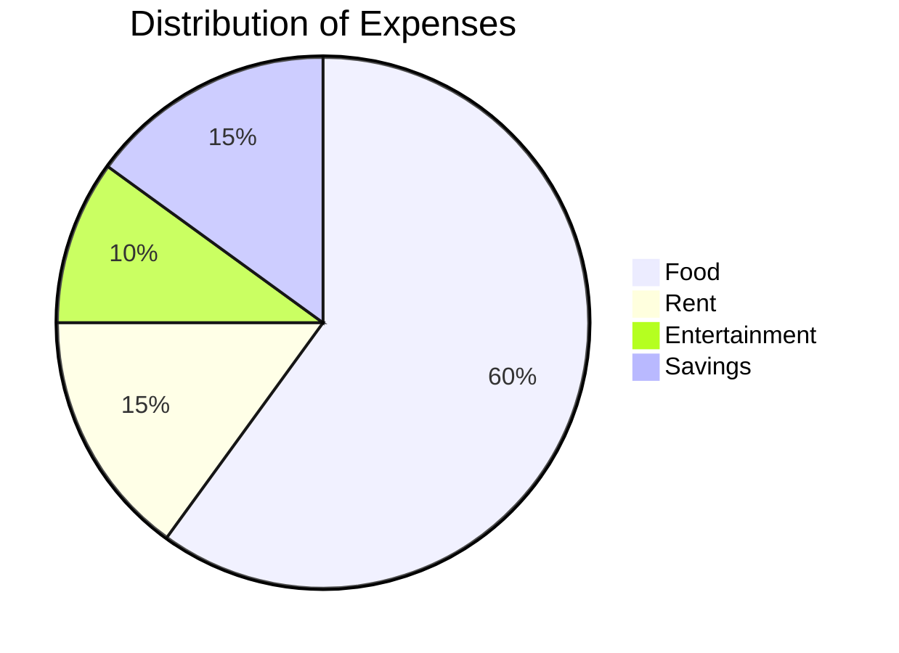

# KEST1_1
Æfing 1
Æfing heima
Önnur æfing
3 æfing
### Eitthvað flott
#### Eitthvað flottara
##### Semi flott

1. Listi
   1. listi
   2. listi
   3. listi
   4. listi
 - annað
 - þriðja
 - fjórða
 - fimmta
---
$${\color{red}Þetta \space er \space rauður \space miðjujafnaður \space texti}$$
 
${\color{blue}Þetta \space er \space blár \space vinstrijafnaður \space texti}$

# $${\color{red}Þetta \space er \space rauður \space miðjujafnaður \space texti}$$

# ${\color{green}Þetta \space er \space vinstrijafnaður \space grænn \space texti}$
 
 Þetta er ***mjög*** mikilvægt
Þetta er ___einnig___ mikilvægt
Þetta er *ítalskt* og **þetta** feitt
I love supporting the **[EFF](https://eff.org)**.
Þetta er linkur sem opnar í nýjum glugga
<a href="https://www.markdownguide.org" target="_blank">Learn Markdown!</a>

---
### Tafla
| abc | def |
| --- | --- |
| bar | baz |
| bar | bar |
---

