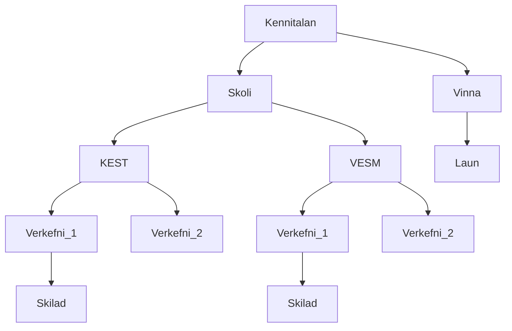
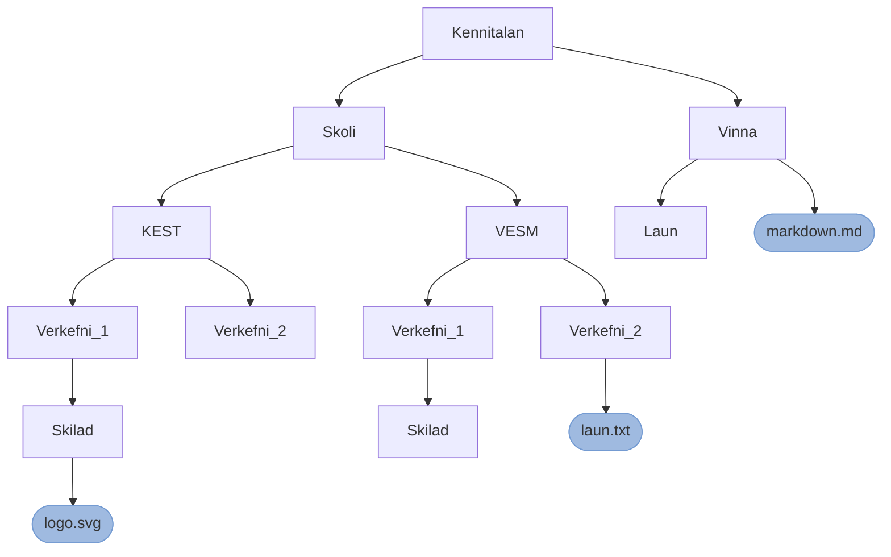

# KEST1VL - Skilaverkefni 2 - 15%

**Athugið að verkefnið er einstaklingsverkefni** ef tveir eða fleiri skila sömu 
lausninni verður gefið 0 (núll) fyrir allar þær lausnir.

**Búðu þér til nýtt textaskjal** (þarf ekki að gera í linux) og skráðu þar inn 
lausnirnar fyrir verkefnin hér fyrir neðan. Skrá þarf inn alla 
skipunina/skipanirnar (með rofum og öðru tilheyrandi) til að leysa hvern lið. 
Textaskjalinu á svo að skila á Innu ásamt tar.xz skránni í lið 8.

:warning: **Skrifaðu efst í svarskjalið hvort þú ert að vinna á Mac eða Linux**

1. (5%) Byrjaðu á að tryggja að þú sért í heimasvæðinu þínu.

   - Hvaða skipun notaðir þú til þess?

2. (5%) Búðu til möppu sem heitir fyrst sex tölurnar úr kennitölunni þinni og 
um leið og þú býrð möppuna til skaltu fara inn í hana.
 
   - Hvað skipun/skipanir notaðir þú til þess?

3. (10%) Búðu til eftirfarandi möppur inn í möppunni sem þú bjóst til í lið 2. 
Notaðu eina skipun til að búa til allar möppurnar.

   - Hvaða skipun notaðir þú til að búa til möppurnar?

:warning: Notaðu `tree` skipunina til að staðfesta að allar möppur hafi orðið 
til og á réttum stað áður en þú ferð í næsta lið verkefnisins.

4. (10%) Búðu **skrárnar** `markdown.md`, `laun.txt` og `logo.svg` í möppunum 
samkvæmt myndinn hér að neðan (skrárnar þurfa ekki að innihalda neitt). 
Keyrðu allar skipanir frá kennitölu möppunni þinni:


   - Hvaða skipanir notaðir þú til að búa til skrárnar?

:warning: Notaðu `tree` skipunina til að staðfesta að allar skrárnar hafi orðið 
til og á réttum stað áður en þú ferð í næsta lið verkefnisins.

5. (5%) Farðu í **Skoli/KEST/Verkefni_1/Skilad** möppuna og færðu `markdown.md` 
skrána í þá möppu. Notaðu *relative path*.
    - Hvað skipun/skipanir notaðir þú til þess?

6. (5%) Vertu áfram í sömu möppu og færðu skrána `laun.txt` í **Vinna/Laun** 
möppuna. Notaðu *relative path*.
    - Hvað skipun/skipanir notaðir þú til þess?

7. (5%) Vertu áfram í sömu möppu og endurnefndu skrána `logo.svg` í `oryggi.txt`. 
Notaðu *absolute path*.
    - Hvað skipun/skipanir notaðir þú til þess?

8. (5%) Búðu til `tar.xz` skrá sem inniheldur **Skóli** og **Vinna** möppurnar 
og allt sem í þeim er. Nefndu skrána með nafninu þínu og passaðu að þjöppunin 
sem þú notar passi við skráarendinguna.
   - Hvað skipun/skipanir notaðir þú til þess?

9. (5%) Skoðaðu innihald tar.xz skrárinnar.
    - Hvað skipun/skipanir notaðir þú til þess?

Í næstu 7 spurningum átt þú að vinna með `fakenames.csv` skrána.

10. (5%) Finndu út hver á lénið (Domain) **bikerroom.is**.

    - Skipun:

11. (5%) Finndu út hversu margir eru í blóðflokkunum (BloodType) O+ og O-. 
Svarið ætti að vera 1245.

    - Skipun:

12. (5%) Finndu út hversu margir heita annaðhvort Valg**a**rður eða 
Valg**e**rður að fornafni. Svarið ætti að vera 9.

    - Skipun:

13. (5%) Finndu út hverjir starfa (Occupation) sem annað hvort 
**Computer programmer** eða **Systems programmer**. Skrifaðu nöfn þeirra 
út á skjáinn og breyttu TAB tákninu yfir í bil (e. space). 
Úttakið ætti að líta svona út:
    ```bash
    Erla Guðmundsdóttir
    Sigurrós Runólfsdóttir
    Valgeir Hreggviðsson
    ``````
    - Skipun:

14. (5%) Finndu út hversu margir eiga símanúmer (TelephoneNumber) sem endar 
á 29. Svarið ætti að vera 26.

    - Skipun:

15. (10%) Finndu út hver býr á Raufarhöfn og er 161 cm. á hæð. 
Svarið ætti að vera Soffía.

    - Skipun:

16. (10%) Finndu út hversu margir eiga bíl (Vehicle) sem skráður er árið 2001. 
Svarið ætti að vera 137 (ath. ekki 138).

    - Skipun:
